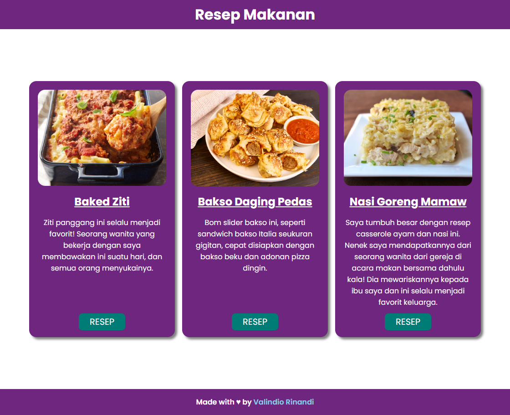

# Resep Makanan

Membuat halaman web resep makanan sederhana

Disini kita belajar :

- Membuat Kerangka dasar html
- Memuat gambar
- Membuat paragraph
- Membuat daftar
- Membuat link
- Menambahkan gaya pada halaman css

Preview : [Website Resep Makanan](https://valindio.github.io/project-resep-makanan)
